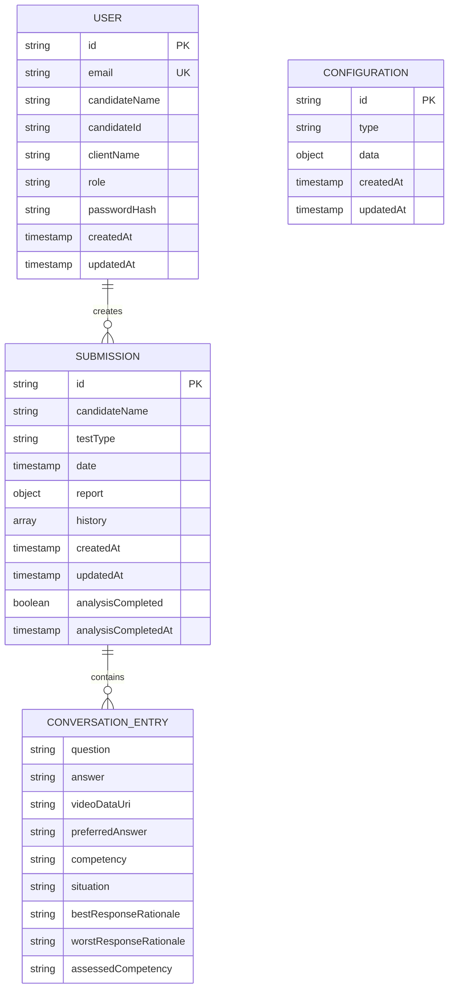
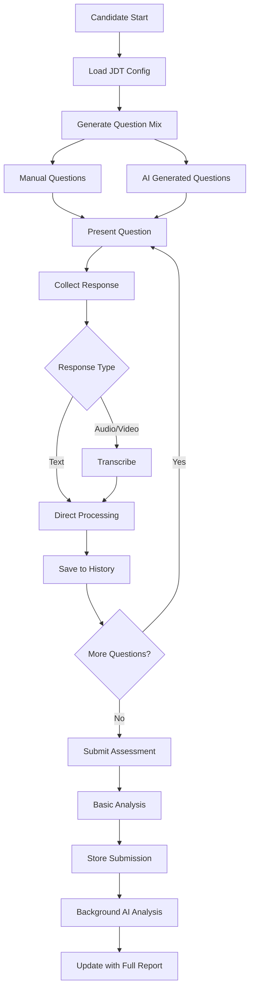
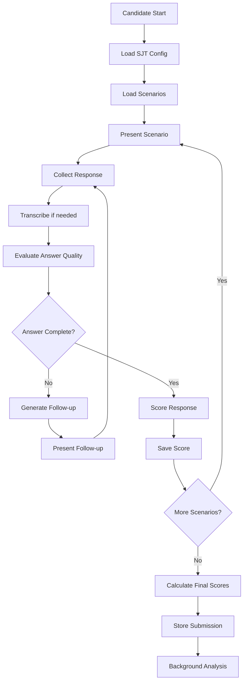

# Verbal Insights - AI Flow & Data Architecture Documentation

## 🧠 AI Processing Engine Deep Dive

### 1. Genkit AI Framework Integration

#### Core Configuration (`src/ai/genkit.ts`):
```typescript
import {genkit} from 'genkit';
import {googleAI} from '@genkit-ai/googleai';

export const ai = genkit({
  plugins: [googleAI()],
  model: 'googleai/gemini-1.5-flash', // Updated to use Gemini 2.0 Flash in flows
});
```

**Framework Benefits**:
- **Structured AI Flows**: Type-safe AI processing pipelines
- **Error Handling**: Built-in retry and fallback mechanisms
- **Prompt Management**: Organized prompt templates with variable injection
- **Model Abstraction**: Easy switching between AI models
- **Development Tools**: Built-in debugging and monitoring

### 2. AI Flow Detailed Analysis

#### **Flow 1: Audio Transcription (`transcribe-audio.ts`)**

**Purpose**: Convert audio/video data to text transcription  
**Input**: Data URI string (audio/video)  
**Output**: Plain text transcription  

```typescript
const TranscribeAudioInputSchema = z.object({
  audioDataUri: z.string().describe('The data URI of the audio file to transcribe.'),
});

const TranscribeAudioOutputSchema = z.object({
  transcript: z.string().describe('The transcribed text from the audio.'),
});

// Implementation uses Handlebars template with media URL
const prompt = ai.definePrompt({
  name: 'transcribeAudioPrompt',
  input: {schema: TranscribeAudioInputSchema},
  output: {schema: TranscribeAudioOutputSchema},
  model: 'googleai/gemini-2.0-flash',
  prompt: `Please transcribe the following audio. Return only the raw text without any formatting.
  
  {{media url=audioDataUri}}`,
});
```

**Technical Implementation**:
- Uses Gemini's multimodal capabilities
- Handles various audio formats (webm, mp4, mp3)
- Returns clean text without formatting
- Error handling with fallback responses

#### **Flow 2: Conversation Analysis (`analyze-conversation.ts`)**

**Purpose**: Comprehensive interview assessment with competency scoring  
**Input**: Complete conversation history with guidance  
**Output**: Structured analysis with qualitative and quantitative assessment  

```typescript
const AnalyzeConversationInputSchema = z.object({
  conversationHistory: z.array(QuestionAnswerSchema),
  name: z.string(),
  roleCategory: z.string(),
  jobDescription: z.string().optional(),
});

const AnalyzeConversationOutputSchema = z.object({
  strengths: z.string(),
  weaknesses: z.string(),
  summary: z.string(),
  competencyAnalysis: z.array(MetaCompetencySchema),
});
```

**Advanced Features**:
- **Dynamic competency detection**: Extracts competencies from question metadata
- **Contextual analysis**: Uses job description for role-specific assessment
- **Structured scoring**: 0-10 scale for each competency
- **Meta-competency grouping**: Organizes related competencies
- **Alphabetical sorting**: Consistent competency ordering

**Prompt Engineering Strategy**:
```typescript
prompt: `You are an expert AI hiring analyst for a top-tier recruitment firm.
Your task is to evaluate a candidate named {{{name}}} for a {{{roleCategory}}} position.

**Job Description Context:**
"{{{jobDescription}}}"

**Interview Transcript & Analysis Guidance:**
{{#each conversationHistory}}
---
**Question: {{{this.question}}}**
**Required Competency: {{{this.competency}}}**
**Ideal Answer Criteria:** "{{{this.preferredAnswer}}}"
**Candidate's Answer:** "{{{this.answer}}}"
{{/each}}

ANALYSIS REQUIRED:
- Assess candidate on each competency: {{{competenciesToAssess}}}
- Score from 0-10 based on answer quality vs ideal criteria
- Group competencies under "Job-Specific Competencies"
- Sort competencies alphabetically
`
```

#### **Flow 3: SJT Response Analysis (`analyze-sjt-response.ts`)**

**Purpose**: Individual scenario response evaluation  
**Input**: Scenario context + candidate response + evaluation criteria  
**Output**: Competency score (0-10) with detailed rationale  

```typescript
const AnalyzeSJTResponseInputSchema = z.object({
  situation: z.string(),
  question: z.string(),
  bestResponseRationale: z.string(),
  worstResponseRationale: z.string(),
  assessedCompetency: z.string(),
  candidateAnswer: z.string(),
});

const AnalyzeSJTResponseOutputSchema = z.object({
  score: z.number().min(0).max(10),
  rationale: z.string(),
});
```

**Evaluation Logic**:
- Compares candidate answer against best/worst response guidelines
- Scores on specified competency (e.g., "Problem Solving", "Leadership")
- Provides detailed rationale explaining the score
- Uses behavioural assessment principles

#### **Flow 4: Answer Quality Evaluation (`evaluate-answer-quality.ts`)**

**Purpose**: Determine if candidate answers are complete or need follow-up  
**Input**: SJT scenario + candidate answer + follow-up context  
**Output**: Completeness assessment + optional follow-up question  

```typescript
const EvaluateAnswerQualityInputSchema = z.object({
  situation: z.string(),
  question: z.string(),
  bestResponseRationale: z.string(),
  assessedCompetency: z.string(),
  candidateAnswer: z.string(),
  questionNumber: z.number(),
  followUpCount: z.number(),
  maxFollowUps: z.number(),
});

const EvaluateAnswerQualityOutputSchema = z.object({
  isComplete: z.boolean(),
  completionScore: z.number().min(0).max(10),
  missingAspects: z.array(z.string()),
  rationale: z.string(),
  followUpQuestion: z.string().optional(),
});
```

**Adaptive Testing Logic**:
- Evaluates answer depth and completeness
- Identifies missing competency aspects
- Generates targeted follow-up questions
- Manages maximum follow-up limits
- Auto-formats follow-up question numbering (1.a, 1.b, etc.)

#### **Flow 5: Follow-up Question Generation (`generate-follow-up-questions.ts`)**

**Purpose**: Dynamic question creation for interviews and SJT follow-ups  
**Input**: Role context + job description + question parameters  
**Output**: Array of relevant questions  

```typescript
const GenerateInterviewQuestionsInputSchema = z.object({
  roleCategory: z.string(),
  jobDescription: z.string(),
  numberOfQuestions: z.number(),
  isFollowUp: z.boolean(),
  name: z.string().optional(),
});

const GenerateInterviewQuestionsOutputSchema = z.object({
  questions: z.array(z.string()),
});
```

**Question Generation Strategy**:
- **Initial Questions**: Friendly introduction + comprehensive assessment
- **Follow-up Questions**: Targeted probing based on previous responses
- **Situational Questions**: Specific to SJT scenarios
- **Fallback Questions**: Pre-defined questions when AI generation fails

#### **Flow 6: Final Verdict Generation (`generate-final-verdict.ts`)**

**Purpose**: Synthesize JDT and SJT results into hiring recommendation  
**Input**: Both JDT and SJT analysis reports  
**Output**: Final recommendation with justification  

```typescript
const GenerateFinalVerdictInputSchema = z.object({
  candidateName: z.string(),
  roleCategory: z.string(),
  jobDescriptionTestReport: AnalysisResultSchema,
  situationalJudgementTestReport: AnalysisResultSchema,
});

const GenerateFinalVerdictOutputSchema = z.object({
  finalVerdict: z.string(),
  recommendation: z.enum(["Strong Hire", "Hire", "Hire with Reservations", "No Hire"]),
  justification: z.string(),
});
```

**Synthesis Logic**:
- Combines technical skills (JDT) with behavioral assessment (SJT)
- Weighs different competency areas
- Provides structured hiring recommendations
- Justifies decisions with specific evidence from both tests

#### **Flow 7: Interview Report Delivery (`send-interview-report.ts`)**

**Purpose**: Format and deliver assessment reports  
**Input**: Candidate details + analysis report + recipient email  
**Output**: Email delivery status  

```typescript
const SendInterviewReportInputSchema = z.object({
  candidateName: z.string(),
  roleCategory: z.string(),
  report: z.object({
    strengths: z.string(),
    weaknesses: z.string(),
    summary: z.string(),
  }),
  recipientEmail: z.string().email(),
});
```

**Report Features**:
- HTML-formatted email reports
- Professional assessment summary
- Structured strengths/weaknesses analysis
- Branded with Trajectorie identity

#### **Flow 8: Text Translation (`translate-text.ts`)**

**Purpose**: Multi-language support for global candidates  
**Input**: Text + target language  
**Output**: Translated text  

```typescript
const TranslateTextInputSchema = z.object({
  textToTranslate: z.string(),
  targetLanguage: z.string(),
});

const TranslateTextOutputSchema = z.object({
  translatedText: z.string(),
});
```

## 📊 Data Architecture & Flow

### 1. Data Models & Relationships

#### Core Entity Relationships:


### 2. Data Processing Pipeline

#### JDT (Job Description Test) Data Flow:


#### SJT (Situational Judgment Test) Data Flow:


### 3. Storage Architecture

#### Hybrid Storage Implementation:
```typescript
// Storage decision logic
const useFirestore = () => {
  const validation = validateFirebaseConfig();
  return validation.isValid;
};

// Dual-path operations
const saveData = async (data: any) => {
  if (useFirestore()) {
    try {
      return await firestoreService.save(data);
    } catch (error) {
      console.error('Firestore failed, using localStorage:', error);
      return localStorageService.save(data);
    }
  } else {
    return localStorageService.save(data);
  }
};
```

#### Storage Configuration Validation:
```typescript
export const validateFirebaseConfig = (): FirebaseValidationResult => {
  const requiredEnvVars = [
    'NEXT_PUBLIC_FIREBASE_API_KEY',
    'NEXT_PUBLIC_FIREBASE_AUTH_DOMAIN',
    'NEXT_PUBLIC_FIREBASE_PROJECT_ID',
    'NEXT_PUBLIC_FIREBASE_STORAGE_BUCKET',
    'NEXT_PUBLIC_FIREBASE_MESSAGING_SENDER_ID',
    'NEXT_PUBLIC_FIREBASE_APP_ID'
  ];
  
  // Check for placeholder values
  const placeholderValues = [
    'your_firebase_api_key_here',
    'your_project.firebaseapp.com',
    'your_project_id',
    'your_project.appspot.com',
    'your_sender_id',
    'your_app_id'
  ];
  
  // Validate each environment variable
  const missingOrInvalid = requiredEnvVars.filter((envVar, index) => {
    const value = process.env[envVar];
    return !value || value === placeholderValues[index] || value.includes('your_');
  });
  
  return {
    isValid: missingOrInvalid.length === 0,
    storageType: missingOrInvalid.length === 0 ? 'firestore' : 'localStorage',
    message: missingOrInvalid.length === 0 
      ? 'Using Firestore Database - Shared storage for all users'
      : `Using Local Storage - Firebase config incomplete. Missing: ${missingOrInvalid.join(', ')}`
  };
};
```

### 4. Real-time Data Synchronization

#### Firestore Real-time Listeners:
```typescript
// Submission monitoring for admin dashboard
export const submissionService = {
  onSubmissionsChange(callback: (submissions: FirestoreSubmission[]) => void): Unsubscribe {
    const q = collection(db, COLLECTIONS.SUBMISSIONS);
    return onSnapshot(q, (querySnapshot) => {
      const submissions = querySnapshot.docs.map(doc => ({
        id: doc.id,
        ...doc.data()
      } as FirestoreSubmission));
      
      // Sort by date for consistent ordering
      const sortedSubmissions = submissions.sort((a, b) => {
        const aTime = a.date?.toMillis ? a.date.toMillis() : 0;
        const bTime = b.date?.toMillis ? b.date.toMillis() : 0;
        return bTime - aTime; // Most recent first
      });
      
      callback(sortedSubmissions);
    });
  }
};
```

#### Context-based Real-time Updates:
```typescript
// Auth context integration
const AuthProvider = ({ children }: { children: ReactNode }) => {
  const [submissions, setSubmissions] = useState<Submission[]>([]);
  
  const onSubmissionsChange = (callback: (submissions: Submission[]) => void) => {
    return submissionService.onSubmissionsChange((firestoreSubmissions) => {
      const convertedSubmissions = firestoreSubmissions.map(convertFirestoreSubmission);
      setSubmissions(convertedSubmissions);
      callback(convertedSubmissions);
    });
  };
  
  return (
    <AuthContext.Provider value={{ onSubmissionsChange, ...otherValues }}>
      {children}
    </AuthContext.Provider>
  );
};
```

This comprehensive AI and data architecture documentation provides developers with deep understanding of the sophisticated AI processing pipeline and robust data management system that powers the Verbal Insights platform.
