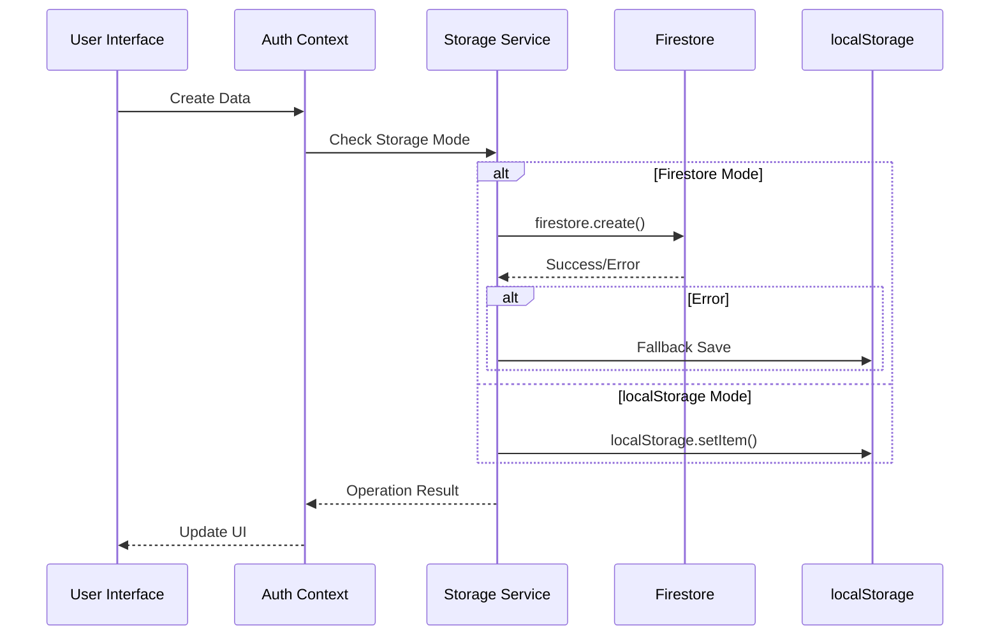
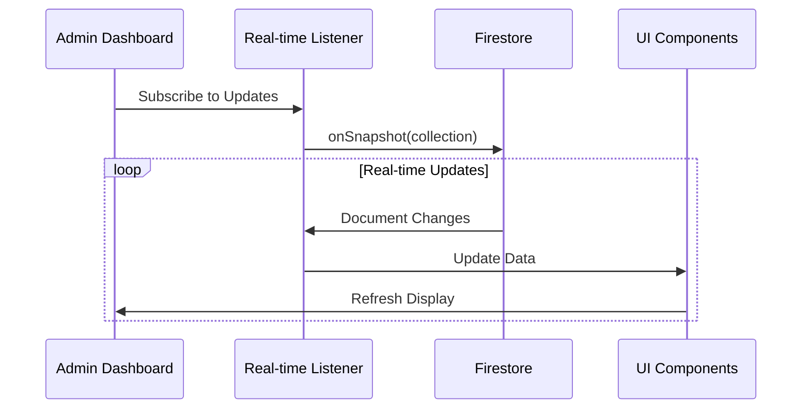

# 🗄️ Verbal Insights - Storage Architecture Flowcharts

> **Note**: This comprehensive storage architecture has been split into multiple focused flowcharts for better GitHub rendering and easier understanding.

## 📋 Flowchart Index

1. **[🔧 Environment Configuration & Storage Mode Selection](#1-environment-configuration--storage-mode-selection)**
2. **[🔐 Authentication Flow](#2-authentication-flow)**
3. **[🎤 Media Recording & Storage](#3-media-recording--storage)**
4. **[💾 Data Storage Operations](#4-data-storage-operations)**
5. **[👨‍💼 Admin Dashboard Operations](#5-admin-dashboard-operations)**
6. **[🔄 Real-time Updates & Error Handling](#6-real-time-updates--error-handling)**

---

## 1. Environment Configuration & Storage Mode Selection

```mermaid
flowchart TD
    A[Application Start] --> B[Check Environment]
    B --> C{NEXT_PUBLIC_USE_LOCALSTORAGE = 'true'?}
    C -->|Yes| LS_FORCE[🔧 Force localStorage Mode]
    C -->|No| VALIDATE[validateFirebaseConfig()]
    
    VALIDATE --> ENV_CHECK[Check Required Variables:<br/>• NEXT_PUBLIC_FIREBASE_API_KEY<br/>• NEXT_PUBLIC_FIREBASE_AUTH_DOMAIN<br/>• NEXT_PUBLIC_FIREBASE_PROJECT_ID<br/>• NEXT_PUBLIC_FIREBASE_STORAGE_BUCKET<br/>• NEXT_PUBLIC_FIREBASE_MESSAGING_SENDER_ID<br/>• NEXT_PUBLIC_FIREBASE_APP_ID]
    
    ENV_CHECK --> PLACEHOLDER_CHECK{Check for Placeholders}
    PLACEHOLDER_CHECK --> VALIDATION{All Variables Valid?}
    
    VALIDATION -->|Yes| FIRESTORE_MODE[🔥 Firestore Mode]
    VALIDATION -->|No| LS_MODE[💾 localStorage Mode]
    
    FIRESTORE_MODE --> NOTIFICATION_FB[📱 Show: 'Cloud Database' 🟢]
    LS_MODE --> NOTIFICATION_LS[📱 Show: 'Local Storage' 🔵]
    LS_FORCE --> NOTIFICATION_LS
    
    NOTIFICATION_FB --> READY[🚀 Application Ready]
    NOTIFICATION_LS --> READY
    
    classDef firestoreClass fill:#ff6b6b,stroke:#000,stroke-width:2px,color:#fff
    classDef localStorageClass fill:#4ecdc4,stroke:#000,stroke-width:2px,color:#fff
    classDef processClass fill:#45b7d1,stroke:#000,stroke-width:2px,color:#fff
    
    class FIRESTORE_MODE,NOTIFICATION_FB firestoreClass
    class LS_MODE,LS_FORCE,NOTIFICATION_LS localStorageClass
    class VALIDATE,ENV_CHECK processClass
```

## 2. Authentication Flow

```mermaid
flowchart TD
    LOGIN[🔐 User Login/Register] --> STORAGE_CHECK{Storage Mode?}
    
    STORAGE_CHECK -->|Firestore| FB_AUTH[🔥 Firestore Authentication]
    STORAGE_CHECK -->|localStorage| LS_AUTH[💾 localStorage Authentication]
    
    %% Firestore Authentication
    FB_AUTH --> FB_LOOKUP[userService.getByEmail(email)]
    FB_LOOKUP --> FB_MATCH{User Found & Password Match?}
    FB_MATCH -->|Yes| SESSION_STORE[Store Session in localStorage]
    FB_MATCH -->|No| AUTH_FAIL[❌ Authentication Failed]
    FB_MATCH -->|Error| FALLBACK[⚠️ Fallback to localStorage]
    
    %% localStorage Authentication
    LS_AUTH --> LS_LOOKUP[Parse localStorage: USERS_KEY]
    LS_LOOKUP --> LS_MATCH{User Found & Password Match?}
    LS_MATCH -->|Yes| SESSION_STORE
    LS_MATCH -->|No| AUTH_FAIL
    
    FALLBACK --> LS_LOOKUP
    
    SESSION_STORE --> SEED_CHECK{First Time Setup?}
    SEED_CHECK -->|Yes| SEED_USERS[🌱 Seed Default Users:<br/>• admin@gmail.com / admin123<br/>• candidate1-10@test.com]
    SEED_CHECK -->|No| LOGIN_SUCCESS[✅ Login Successful]
    
    SEED_USERS --> SEED_MODE{Storage Mode?}
    SEED_MODE -->|Firestore| SEED_FB[Seed to Firestore]
    SEED_MODE -->|localStorage| SEED_LS[Seed to localStorage]
    
    SEED_FB --> SEED_SUCCESS{Success?}
    SEED_SUCCESS -->|Yes| LOGIN_SUCCESS
    SEED_SUCCESS -->|No| SEED_LS
    
    SEED_LS --> LOGIN_SUCCESS
    
    classDef firestoreClass fill:#ff6b6b,stroke:#000,stroke-width:2px,color:#fff
    classDef localStorageClass fill:#4ecdc4,stroke:#000,stroke-width:2px,color:#fff
    classDef errorClass fill:#ffd93d,stroke:#000,stroke-width:2px,color:#000
    classDef successClass fill:#00b894,stroke:#000,stroke-width:2px,color:#fff
    
    class FB_AUTH,FB_LOOKUP,SEED_FB firestoreClass
    class LS_AUTH,LS_LOOKUP,SEED_LS localStorageClass
    class AUTH_FAIL,FALLBACK errorClass
    class LOGIN_SUCCESS,SESSION_STORE successClass
```

## 3. Media Recording & Storage

```mermaid
flowchart TD
    INTERVIEW[🎤 Start Interview Recording] --> PERMISSIONS{Browser Permissions?}
    PERMISSIONS -->|Granted| RECORDER[Start MediaRecorder]
    PERMISSIONS -->|Denied| PERM_ERROR[❌ Permission Error]
    
    RECORDER --> MEDIA_TYPE{Capture Mode}
    MEDIA_TYPE -->|Audio| AUDIO[🎤 Audio Recording<br/>MIME: audio/webm]
    MEDIA_TYPE -->|Video| VIDEO[📹 Video Recording<br/>MIME: video/webm]
    
    AUDIO --> PROCESSING[Media Processing]
    VIDEO --> PROCESSING
    
    PROCESSING --> BLOB[Create Blob from chunks]
    BLOB --> DATA_URI[Convert to Data URI]
    DATA_URI --> SIZE_CHECK{Size > 500KB?}
    
    SIZE_CHECK -->|No| SMALL_MEDIA[💾 Store as Data URI]
    SIZE_CHECK -->|Yes| LARGE_MEDIA[☁️ Upload to Firebase Storage]
    
    LARGE_MEDIA --> STORAGE_AVAILABLE{Firebase Storage Available?}
    STORAGE_AVAILABLE -->|Yes| UPLOAD_PROCESS[🔥 Firebase Storage Upload]
    STORAGE_AVAILABLE -->|No| FALLBACK_SMALL[⚠️ Keep as Data URI]
    
    UPLOAD_PROCESS --> CONVERT_BLOB[dataUriToBlob()]
    CONVERT_BLOB --> STORAGE_PATH[Path: submissions/{id}/Q{n}_{type}.webm]
    STORAGE_PATH --> UPLOAD_BYTES[uploadBytes()]
    UPLOAD_BYTES --> DOWNLOAD_URL[📎 Get Download URL]
    
    SMALL_MEDIA --> PREPARE_SUBMISSION[Prepare Submission]
    DOWNLOAD_URL --> PREPARE_SUBMISSION
    FALLBACK_SMALL --> PREPARE_SUBMISSION
    
    classDef mediaClass fill:#6c5ce7,stroke:#000,stroke-width:2px,color:#fff
    classDef processClass fill:#45b7d1,stroke:#000,stroke-width:2px,color:#fff
    classDef storageClass fill:#ff6b6b,stroke:#000,stroke-width:2px,color:#fff
    classDef errorClass fill:#ffd93d,stroke:#000,stroke-width:2px,color:#000
    
    class AUDIO,VIDEO,BLOB,DATA_URI mediaClass
    class PROCESSING,CONVERT_BLOB,PREPARE_SUBMISSION processClass
    class UPLOAD_PROCESS,STORAGE_PATH,UPLOAD_BYTES,DOWNLOAD_URL storageClass
    class PERM_ERROR,FALLBACK_SMALL errorClass
```

## 4. Data Storage Operations

```mermaid
flowchart TD
    SAVE_DATA[💾 Save Data Request] --> DATA_TYPE{Data Type}
    
    DATA_TYPE --> SUBMISSION[📝 Submission]
    DATA_TYPE --> USER[👤 User]
    DATA_TYPE --> CONFIG[⚙️ Configuration]
    
    %% Submission Flow
    SUBMISSION --> SUB_STORAGE{Storage Mode?}
    SUB_STORAGE -->|Firestore| SUB_FB[🔥 submissionService.create()]
    SUB_STORAGE -->|localStorage| SUB_LS[💾 localStorage.setItem(SUBMISSIONS_KEY)]
    
    SUB_FB --> SUB_SUCCESS{Success?}
    SUB_SUCCESS -->|Yes| REALTIME[📡 Trigger Real-time Updates]
    SUB_SUCCESS -->|No| SUB_FALLBACK[⚠️ Fallback to localStorage]
    SUB_FALLBACK --> SUB_LS
    
    %% User Flow
    USER --> USER_STORAGE{Storage Mode?}
    USER_STORAGE -->|Firestore| USER_FB[🔥 userService.create/update/delete()]
    USER_STORAGE -->|localStorage| USER_LS[💾 localStorage.setItem(USERS_KEY)]
    
    USER_FB --> USER_SUCCESS{Success?}
    USER_SUCCESS -->|Yes| UPDATE_SESSION[Update Current Session]
    USER_SUCCESS -->|No| USER_FALLBACK[⚠️ Fallback to localStorage]
    USER_FALLBACK --> USER_LS
    
    %% Configuration Flow
    CONFIG --> CONFIG_STORAGE{Storage Mode?}
    CONFIG_STORAGE -->|Firestore| CONFIG_FB[🔥 configService.save()]
    CONFIG_STORAGE -->|localStorage| CONFIG_LS[💾 localStorage.setItem(CONFIG_KEYS)]
    
    CONFIG_FB --> CONFIG_SUCCESS{Success?}
    CONFIG_SUCCESS -->|Yes| CONFIG_COMPLETE[✅ Config Saved]
    CONFIG_SUCCESS -->|No| CONFIG_FALLBACK[⚠️ Fallback to localStorage]
    CONFIG_FALLBACK --> CONFIG_LS
    
    SUB_LS --> COMPLETE[✅ Operation Complete]
    USER_LS --> COMPLETE
    CONFIG_LS --> COMPLETE
    REALTIME --> COMPLETE
    UPDATE_SESSION --> COMPLETE
    CONFIG_COMPLETE --> COMPLETE
    
    classDef firestoreClass fill:#ff6b6b,stroke:#000,stroke-width:2px,color:#fff
    classDef localStorageClass fill:#4ecdc4,stroke:#000,stroke-width:2px,color:#fff
    classDef errorClass fill:#ffd93d,stroke:#000,stroke-width:2px,color:#000
    classDef successClass fill:#00b894,stroke:#000,stroke-width:2px,color:#fff
    
    class SUB_FB,USER_FB,CONFIG_FB firestoreClass
    class SUB_LS,USER_LS,CONFIG_LS localStorageClass
    class SUB_FALLBACK,USER_FALLBACK,CONFIG_FALLBACK errorClass
    class COMPLETE,REALTIME,UPDATE_SESSION,CONFIG_COMPLETE successClass
```

## 5. Admin Dashboard Operations

```mermaid
flowchart TD
    ADMIN[👨‍💼 Admin Dashboard] --> OPERATION{Operation Type}
    
    OPERATION --> VIEW_SUBS[📊 View Submissions]
    OPERATION --> MANAGE_USERS[👥 Manage Users]
    OPERATION --> DOWNLOAD[📁 Download Media]
    OPERATION --> CONFIG_MGMT[⚙️ Manage Configurations]
    
    %% View Submissions
    VIEW_SUBS --> SUB_MODE{Storage Mode?}
    SUB_MODE -->|Firestore| FB_REALTIME[🔥 Real-time Listener<br/>submissionService.onSubmissionsChange()]
    SUB_MODE -->|localStorage| LS_PARSE[💾 Parse localStorage<br/>SUBMISSIONS_KEY]
    
    FB_REALTIME --> SNAPSHOT[onSnapshot(collection)]
    SNAPSHOT --> TRANSFORM[Transform Documents]
    TRANSFORM --> SORT[Sort by Date]
    SORT --> DISPLAY[📋 Display in Dashboard]
    
    LS_PARSE --> DISPLAY
    
    %% Download Media
    DOWNLOAD --> MEDIA_TYPE{Media Type?}
    MEDIA_TYPE --> DATA_URI_MEDIA[📎 Data URI Media]
    MEDIA_TYPE --> STORAGE_URL[☁️ Firebase Storage URL]
    
    DATA_URI_MEDIA --> FETCH_URI[fetch(dataUri)]
    STORAGE_URL --> FETCH_STORAGE[fetch(storageUrl)]
    
    FETCH_URI --> CREATE_ZIP[📁 Create ZIP with JSZip]
    FETCH_STORAGE --> CREATE_ZIP
    CREATE_ZIP --> DOWNLOAD_ZIP[💾 Download ZIP File]
    
    %% Manage Users & Configs
    MANAGE_USERS --> USER_CRUD[Create/Update/Delete Users]
    CONFIG_MGMT --> CONFIG_CRUD[JDT/SJT/Global Settings]
    
    USER_CRUD --> STORAGE_OPS[Storage Operations]
    CONFIG_CRUD --> STORAGE_OPS
    STORAGE_OPS --> DISPLAY
    
    classDef firestoreClass fill:#ff6b6b,stroke:#000,stroke-width:2px,color:#fff
    classDef localStorageClass fill:#4ecdc4,stroke:#000,stroke-width:2px,color:#fff
    classDef processClass fill:#45b7d1,stroke:#000,stroke-width:2px,color:#fff
    classDef mediaClass fill:#6c5ce7,stroke:#000,stroke-width:2px,color:#fff
    classDef successClass fill:#00b894,stroke:#000,stroke-width:2px,color:#fff
    
    class FB_REALTIME,SNAPSHOT,FETCH_STORAGE firestoreClass
    class LS_PARSE localStorageClass
    class TRANSFORM,SORT,USER_CRUD,CONFIG_CRUD processClass
    class DATA_URI_MEDIA,STORAGE_URL,CREATE_ZIP mediaClass
    class DISPLAY,DOWNLOAD_ZIP successClass
```

## 6. Real-time Updates & Error Handling

```mermaid
flowchart TD
    TRIGGER[📡 Data Change Trigger] --> REALTIME{Real-time Available?}
    
    REALTIME -->|Yes| FIRESTORE_LISTENER[🔥 Firestore onSnapshot()]
    REALTIME -->|No| POLLING[🔄 Manual Refresh]
    
    FIRESTORE_LISTENER --> CONNECTED_CLIENTS[📱 All Connected Clients]
    CONNECTED_CLIENTS --> UPDATE_UI[🔄 Live UI Updates]
    
    %% Error Handling
    UPDATE_UI --> ERROR_CHECK{Errors Occurred?}
    ERROR_CHECK -->|No| SUCCESS[✅ Update Complete]
    ERROR_CHECK -->|Yes| ERROR_TYPE{Error Type}
    
    ERROR_TYPE --> NETWORK_ERROR[🌐 Network Error]
    ERROR_TYPE --> PERMISSION_ERROR[🔐 Permission Error]
    ERROR_TYPE --> CONFIG_ERROR[⚙️ Configuration Error]
    
    NETWORK_ERROR --> FALLBACK_LS[⚠️ Fallback to localStorage]
    PERMISSION_ERROR --> RETRY[🔄 Retry with Fallback]
    CONFIG_ERROR --> REVALIDATE[🔧 Revalidate Configuration]
    
    FALLBACK_LS --> FALLBACK_SUCCESS[✅ Fallback Complete]
    RETRY --> RETRY_SUCCESS[✅ Retry Successful]
    REVALIDATE --> CONFIG_UPDATE[⚙️ Update Storage Mode]
    
    %% Recovery Flow
    FALLBACK_SUCCESS --> RECOVERY{Connection Restored?}
    RECOVERY -->|Yes| SYNC_DATA[🔄 Sync Data Back]
    RECOVERY -->|No| CONTINUE_FALLBACK[Continue with localStorage]
    
    SYNC_DATA --> SUCCESS
    CONTINUE_FALLBACK --> SUCCESS
    RETRY_SUCCESS --> SUCCESS
    CONFIG_UPDATE --> SUCCESS
    
    classDef firestoreClass fill:#ff6b6b,stroke:#000,stroke-width:2px,color:#fff
    classDef localStorageClass fill:#4ecdc4,stroke:#000,stroke-width:2px,color:#fff
    classDef errorClass fill:#ffd93d,stroke:#000,stroke-width:2px,color:#000
    classDef successClass fill:#00b894,stroke:#000,stroke-width:2px,color:#fff
    classDef processClass fill:#45b7d1,stroke:#000,stroke-width:2px,color:#fff
    
    class FIRESTORE_LISTENER,CONNECTED_CLIENTS,SYNC_DATA firestoreClass
    class FALLBACK_LS,CONTINUE_FALLBACK localStorageClass
    class NETWORK_ERROR,PERMISSION_ERROR,CONFIG_ERROR errorClass
    class SUCCESS,FALLBACK_SUCCESS,RETRY_SUCCESS successClass
        class UPDATE_UI,RETRY,REVALIDATE,CONFIG_UPDATE processClass
```

---

## 📋 Storage Architecture Key Components

### 🔧 **Environment Configuration Detection**
```typescript
// Environment Variable Validation Process
validateFirebaseConfig() {
  checkEnvVars: [
    'NEXT_PUBLIC_FIREBASE_API_KEY',
    'NEXT_PUBLIC_FIREBASE_AUTH_DOMAIN', 
    'NEXT_PUBLIC_FIREBASE_PROJECT_ID',
    'NEXT_PUBLIC_FIREBASE_STORAGE_BUCKET',
    'NEXT_PUBLIC_FIREBASE_MESSAGING_SENDER_ID',
    'NEXT_PUBLIC_FIREBASE_APP_ID'
  ]
  
  detectPlaceholders: [
    'your_firebase_api_key_here',
    'your_project.firebaseapp.com',
    'your_project_id',
    'your_project.appspot.com',
    'your_sender_id',
    'your_app_id'
  ]
  
  return: {
    isValid: boolean,
    storageType: 'firestore' | 'localStorage',
    message: string
  }
}
```

### 🗄️ **Storage Layer Architecture**

#### **Primary Storage (Firestore)**
- **Database**: Firebase Firestore NoSQL database
- **Collections**: 
  - `users` → User accounts and authentication data
  - `submissions` → Interview responses and AI analysis
  - `configurations` → JDT/SJT/Global settings
- **Real-time**: onSnapshot() listeners for live updates
- **Security**: Firestore security rules for access control

#### **Fallback Storage (localStorage)**
- **Keys**:
  - `USERS_KEY` → User data storage
  - `SUBMISSIONS_KEY` → Interview submissions
  - `SESSION_KEY` → Current user session
  - `JDT_CONFIG_KEY` → JDT configuration
  - `SJT_CONFIG_KEY` → SJT configuration
  - `GLOBAL_SETTINGS_KEY` → Global settings
- **Scope**: Browser-specific, device-local storage
- **Persistence**: Survives browser sessions, not shared

### 📁 **Media Storage Strategy**

#### **Small Media Files (< 500KB)**
```typescript
// Stored as Data URI in database
videoDataUri: "data:video/webm;base64,GkXfo..."
```
- **Format**: Base64 encoded data URIs
- **Storage**: Directly in Firestore document or localStorage
- **Retrieval**: Immediate access from database

#### **Large Media Files (> 500KB)**
```typescript
// Uploaded to Firebase Storage
uploadPath: "submissions/{submissionId}/Q{index}_{mediaType}.webm"
downloadURL: "https://firebasestorage.googleapis.com/..."
```
- **Process**: 
  1. Convert Data URI → Blob
  2. Upload to Firebase Storage
  3. Store download URL in database
- **Benefits**: Bypasses Firestore 1MB document limit
- **Fallback**: Keep as Data URI if Firebase Storage fails

### 🔄 **Error Handling & Resilience**

#### **Graceful Degradation Pattern**
```typescript
async operation() {
  if (useFirestore()) {
    try {
      return await firestoreService.operation();
    } catch (error) {
      console.error('Firestore failed, falling back:', error);
      return localStorageService.operation();
    }
  } else {
    return localStorageService.operation();
  }
}
```

#### **Connection Resilience**
- **Network Errors**: Automatic fallback to localStorage
- **Permission Errors**: Graceful error messages with fallback
- **Configuration Errors**: Smart detection and appropriate storage selection
- **Browser Compatibility**: Feature detection for storage capabilities

### 🛡️ **Security Considerations**

#### **Data Protection**
- **Environment Variables**: Sensitive configs in environment only
- **API Keys**: Protected Firebase configuration
- **User Data**: Role-based access control
- **Media URLs**: Secure Firebase Storage URLs with access tokens

#### **Access Control Example**
```javascript
// Firestore Security Rules
rules_version = '2';
service cloud.firestore {
  match /databases/{database}/documents {
    // Users can only access their own data
    match /users/{userId} {
      allow read, write: if request.auth.uid == userId;
    }
    
    // Admin access to all data
    match /{document=**} {
      allow read, write: if request.auth.token.role == 'admin';
    }
  }
}
```

## 🎯 **Flowchart Benefits**

### **✅ Better GitHub Rendering**
- **Smaller Diagrams**: Each flowchart is focused and lightweight
- **Faster Loading**: No more "too complex" warnings
- **Clear Navigation**: Easy to jump between related flows

### **📖 Improved Comprehension**
- **Focused Topics**: Each diagram covers one specific area
- **Logical Progression**: Follow the numbered sequence for complete understanding
- **Cross-References**: Related flows reference each other

### **🔧 Easier Maintenance**
- **Modular Updates**: Change one flowchart without affecting others
- **Targeted Improvements**: Add detail to specific areas as needed
- **Version Control**: Cleaner diffs when making changes

This modular approach provides the same comprehensive coverage while ensuring optimal GitHub rendering and user experience! 🚀
```

## 📋 Storage Architecture Key Components

### 🔧 **Environment Configuration Detection**
```typescript
// Environment Variable Validation Process
validateFirebaseConfig() {
  checkEnvVars: [
    'NEXT_PUBLIC_FIREBASE_API_KEY',
    'NEXT_PUBLIC_FIREBASE_AUTH_DOMAIN', 
    'NEXT_PUBLIC_FIREBASE_PROJECT_ID',
    'NEXT_PUBLIC_FIREBASE_STORAGE_BUCKET',
    'NEXT_PUBLIC_FIREBASE_MESSAGING_SENDER_ID',
    'NEXT_PUBLIC_FIREBASE_APP_ID'
  ]
  
  detectPlaceholders: [
    'your_firebase_api_key_here',
    'your_project.firebaseapp.com',
    'your_project_id',
    'your_project.appspot.com',
    'your_sender_id',
    'your_app_id'
  ]
  
  return: {
    isValid: boolean,
    storageType: 'firestore' | 'localStorage',
    message: string
  }
}
```

### 🗄️ **Storage Layer Architecture**

#### **Primary Storage (Firestore)**
- **Database**: Firebase Firestore NoSQL database
- **Collections**: 
  - `users` → User accounts and authentication data
  - `submissions` → Interview responses and AI analysis
  - `configurations` → JDT/SJT/Global settings
- **Real-time**: onSnapshot() listeners for live updates
- **Security**: Firestore security rules for access control

#### **Fallback Storage (localStorage)**
- **Keys**:
  - `USERS_KEY` → User data storage
  - `SUBMISSIONS_KEY` → Interview submissions
  - `SESSION_KEY` → Current user session
  - `JDT_CONFIG_KEY` → JDT configuration
  - `SJT_CONFIG_KEY` → SJT configuration
  - `GLOBAL_SETTINGS_KEY` → Global settings
- **Scope**: Browser-specific, device-local storage
- **Persistence**: Survives browser sessions, not shared

### 📁 **Media Storage Strategy**

#### **Small Media Files (< 500KB)**
```typescript
// Stored as Data URI in database
videoDataUri: "data:video/webm;base64,GkXfo..."
```
- **Format**: Base64 encoded data URIs
- **Storage**: Directly in Firestore document or localStorage
- **Retrieval**: Immediate access from database

#### **Large Media Files (> 500KB)**
```typescript
// Uploaded to Firebase Storage
uploadPath: "submissions/{submissionId}/Q{index}_{mediaType}.webm"
downloadURL: "https://firebasestorage.googleapis.com/..."
```
- **Process**: 
  1. Convert Data URI → Blob
  2. Upload to Firebase Storage
  3. Store download URL in database
- **Benefits**: Bypasses Firestore 1MB document limit
- **Fallback**: Keep as Data URI if Firebase Storage fails

### 🔄 **Data Flow Patterns**

#### **Create Operations**


#### **Read Operations with Real-time Updates**


### 🛡️ **Error Handling & Resilience**

#### **Graceful Degradation Pattern**
```typescript
async operation() {
  if (useFirestore()) {
    try {
      return await firestoreService.operation();
    } catch (error) {
      console.error('Firestore failed, falling back:', error);
      return localStorageService.operation();
    }
  } else {
    return localStorageService.operation();
  }
}
```

#### **Connection Resilience**
- **Network Errors**: Automatic fallback to localStorage
- **Permission Errors**: Graceful error messages with fallback
- **Configuration Errors**: Smart detection and appropriate storage selection
- **Browser Compatibility**: Feature detection for storage capabilities

### 📊 **Performance Optimizations**

#### **Media Handling Optimizations**
- **Size Threshold**: 500KB limit for database storage
- **Compression**: WebM format for optimal compression
- **Lazy Loading**: Media files loaded on-demand
- **Caching**: Browser caching for Firebase Storage URLs

#### **Database Query Optimizations**
- **Real-time Listeners**: Only where needed (admin dashboard)
- **Indexed Queries**: Optimized Firestore queries
- **Pagination**: Large datasets handled efficiently
- **Local Caching**: Session storage for frequently accessed data

### 🔐 **Security Considerations**

#### **Data Protection**
- **Environment Variables**: Sensitive configs in environment only
- **API Keys**: Protected Firebase configuration
- **User Data**: Role-based access control
- **Media URLs**: Secure Firebase Storage URLs with access tokens

#### **Access Control**
```javascript
// Firestore Security Rules Example
rules_version = '2';
service cloud.firestore {
  match /databases/{database}/documents {
    // Users can only access their own data
    match /users/{userId} {
      allow read, write: if request.auth.uid == userId;
    }
    
    // Admin access to all data
    match /{document=**} {
      allow read, write: if request.auth.token.role == 'admin';
    }
  }
}
```

This comprehensive flowchart shows every aspect of the storage architecture, from environment detection to media handling, with detailed error handling and fallback mechanisms. The system is designed for resilience, performance, and seamless user experience regardless of the storage backend.
