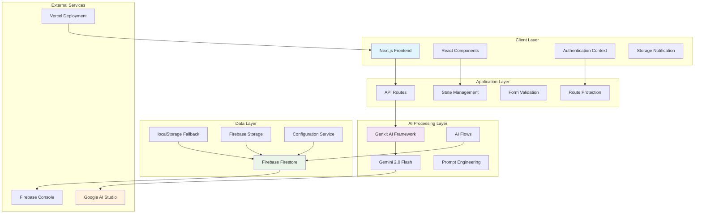
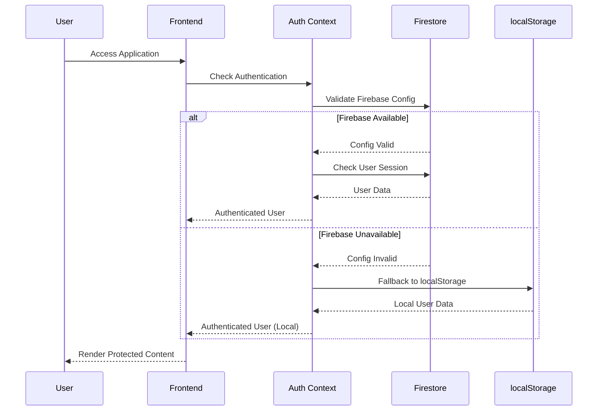
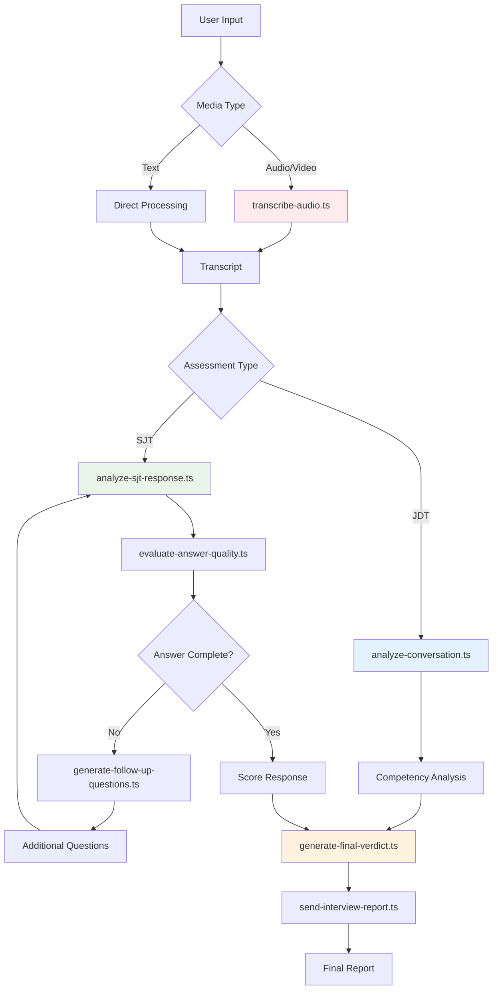
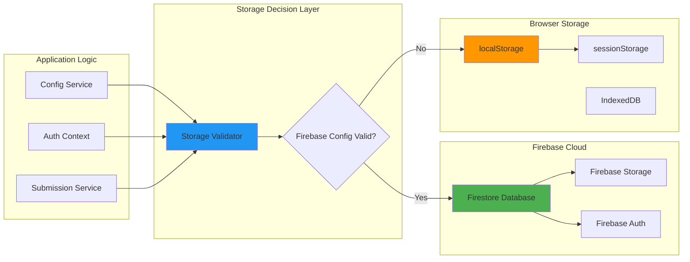

# Verbal Insights - Detailed Architecture & Implementation Guide

## 🏛️ System Architecture Diagrams

### 1. Overall System Architecture



### 2. Authentication & User Management Flow



### 3. AI Processing Workflow



### 4. Data Storage Architecture



## 🔧 Implementation Details

### 1. Authentication System Implementation

#### Current Active Implementation: `auth-context.tsx`
```typescript
interface AuthContextType {
  user: User | null;
  login: (email: string, pass: string) => Promise<boolean>;
  logout: () => void;
  register: (details: Omit<User, 'id'> & {password: string}) => Promise<boolean>;
  loading: boolean;
  saveSubmission: (submission: Omit<Submission, 'id' | 'date'>) => Promise<void>;
  getSubmissions: () => Promise<Submission[]>;
  getSubmissionById: (id: string) => Promise<Submission | null>;
  deleteSubmission: (id: string) => Promise<void>;
  clearAllSubmissions: () => Promise<void>;
  getUsers: () => Promise<User[]>;
  deleteUser: (userId: string) => Promise<void>;
  updateUser: (userId: string, updates: Partial<User>) => Promise<void>;
  getUserAttempts: (testType: 'JDT' | 'SJT') => Promise<number>;
  canUserTakeTest: (testType: 'JDT' | 'SJT', maxAttempts: number) => Promise<boolean>;
  onSubmissionsChange: (callback: (submissions: Submission[]) => void) => void;
}
```

**Key Features**:
- **Database-only mode**: Uses Firestore exclusively with comprehensive error handling
- **User seeding**: Automatic creation of admin and test users
- **Real-time updates**: Live submission tracking
- **Attempt tracking**: Prevents multiple test attempts
- **Session management**: Persistent login state

#### User Management Strategy:
1. **Superadmin**: `superadmin@gmail.com` (highest privilege)
2. **Admin**: `admin@gmail.com` (administrative access)
3. **Test Users**: 10 pre-seeded candidates for testing
4. **Dynamic Registration**: New users can register via `/register`

### 2. AI Flow Implementations

#### Core AI Flows Analysis:

**1. Transcription Flow (`transcribe-audio.ts`)**
```typescript
export async function transcribeAudio(input: TranscribeAudioInput): Promise<TranscribeAudioOutput> {
  // Uses Gemini model with media URL handling
  // Processes audio/video data URI
  // Returns plain text transcription
}
```

**2. Conversation Analysis (`analyze-conversation.ts`)**
```typescript
export async function analyzeConversation(input: AnalyzeConversationInput): Promise<AnalyzeConversationOutput> {
  // Comprehensive interview assessment
  // Competency-based scoring system
  // Generates qualitative and quantitative analysis
  // Returns structured AnalysisResult
}
```

**3. SJT Response Analysis (`analyze-sjt-response.ts`)**
```typescript
export async function analyzeSJTResponse(input: AnalyzeSJTResponseInput): Promise<AnalyzeSJTResponseOutput> {
  // Evaluates against best/worst response rationale
  // Scores on 0-10 scale for specific competency
  // Provides detailed rationale
}
```

**4. Answer Quality Evaluation (`evaluate-answer-quality.ts`)**
```typescript
export async function evaluateAnswerQuality(input: EvaluateAnswerQualityInput): Promise<EvaluateAnswerQualityOutput> {
  // Determines answer completeness
  // Generates follow-up questions when needed
  // Manages maximum follow-up limits
  // Supports adaptive questioning
}
```

### 3. Database Schema & Operations

#### Firestore Collections Structure:

**Users Collection**:
```typescript
interface FirestoreUser {
  id: string;
  email: string;
  candidateName: string;
  candidateId: string;
  clientName: string;
  role: string;
  passwordHash: string; // Currently plain text - needs hashing
  createdAt: Timestamp;
  updatedAt: Timestamp;
}
```

**Submissions Collection**:
```typescript
interface FirestoreSubmission {
  id: string;
  candidateName: string;
  testType: 'JDT' | 'SJT';
  date: Timestamp;
  report: AnalysisResult;
  history: ConversationEntry[];
  createdAt: Timestamp;
  updatedAt: Timestamp;
  analysisCompleted?: boolean;
  analysisCompletedAt?: Date;
}
```

**Configurations Collection**:
```typescript
interface FirestoreConfig {
  id: string;
  type: 'jdt' | 'sjt' | 'global';
  data: any; // Flexible configuration object
  createdAt: Timestamp;
  updatedAt: Timestamp;
}
```

#### Database Service Implementation:
- **CRUD Operations**: Full create, read, update, delete functionality
- **Real-time Listeners**: Live data synchronization
- **Error Handling**: Graceful fallbacks to localStorage
- **Data Validation**: TypeScript interfaces ensure data integrity

### 4. Component Architecture

#### Admin Components:
- **Admin Dashboard** (`/admin/page.tsx`): Main admin interface
- **User Management** (`/admin/users/page.tsx`): Candidate management
- **JDT Configuration** (`/admin/jd/page.tsx`): Interview setup
- **SJT Configuration** (`/admin/sjt/page.tsx`): Scenario management
- **Submissions Review** (`/admin/submissions/page.tsx`): Results dashboard
- **Report Viewer** (`/admin/report/[id]/page.tsx`): Detailed analysis

#### Candidate Components:
- **Interview Page** (`/interview/page.tsx`): JDT assessment interface
- **SJT Page** (`/sjt/page.tsx`): Situational judgment testing
- **Pre-Interview Forms**: Candidate information collection
- **Audio/Video Recorder**: Multi-modal response capture
- **Real-time Transcription**: Live speech-to-text display

#### Shared Components:
- **Authentication**: Login/register forms
- **UI Components**: 22 shadcn/ui components
- **Storage Notification**: Storage type indicator
- **Progress Tracking**: Session state management

### 5. Configuration Management System

#### Three-Tier Configuration:
1. **Global Settings** (`global` type)
   - Language options
   - Default interview mode
   - Report visibility settings
   - System-wide preferences

2. **JDT Configuration** (`jdt` type)
   - Role definitions with job descriptions
   - Manual questions per role
   - AI-generated question limits
   - Time limits and settings

3. **SJT Configuration** (`sjt` type)
   - Scenario definitions
   - Best/worst response rationale
   - Competency mappings
   - Follow-up question limits

#### Storage Strategy:
```typescript
const configurationService = {
  async saveJDTConfig(config: any): Promise<boolean>
  async getJDTConfig(): Promise<any | null>
  async saveSJTConfig(config: any): Promise<boolean>
  async getSJTConfig(): Promise<any | null>
  async saveGlobalSettings(settings: any): Promise<boolean>
  async getGlobalSettings(): Promise<any | null>
}
```

## 🔄 Real-time Features

### 1. Live Submission Tracking
- Admin dashboard updates automatically when candidates submit
- Real-time listener on submissions collection
- Instant notification of new assessments

### 2. Dynamic Question Generation
- AI-powered follow-up questions based on response quality
- Adaptive testing that adjusts to candidate answers
- Maximum follow-up limits to prevent infinite loops

### 3. Live Transcription
- Real-time speech-to-text during audio/video responses
- Immediate feedback for candidates
- Confidence indicators for transcription accuracy

## 🚀 Deployment Architecture

### Vercel Integration:
- **Build Process**: Next.js production build
- **Environment Variables**: Firebase configuration
- **API Routes**: Serverless functions for AI processing
- **Static Assets**: Optimized image and CSS delivery
- **Edge Functions**: Global distribution for performance

### Firebase Services:
- **Firestore**: Primary database with security rules
- **Storage**: Media file handling for large recordings
- **Authentication**: Optional Firebase Auth integration
- **Hosting**: Alternative to Vercel for Firebase ecosystem

### Environment Configuration:
```bash
# Required for AI Processing
GEMINI_API_KEY="your_google_ai_api_key"

# Firebase Configuration (Optional - uses localStorage if missing)
NEXT_PUBLIC_FIREBASE_API_KEY="your_firebase_api_key"
NEXT_PUBLIC_FIREBASE_AUTH_DOMAIN="your_project.firebaseapp.com"
NEXT_PUBLIC_FIREBASE_PROJECT_ID="your_project_id"
NEXT_PUBLIC_FIREBASE_STORAGE_BUCKET="your_project.appspot.com"
NEXT_PUBLIC_FIREBASE_MESSAGING_SENDER_ID="your_sender_id"
NEXT_PUBLIC_FIREBASE_APP_ID="your_app_id"

# Optional Overrides
NEXT_PUBLIC_USE_LOCALSTORAGE="true" # Force localStorage mode
```

This implementation demonstrates enterprise-grade architecture with production-ready features, comprehensive error handling, and scalable design patterns.
